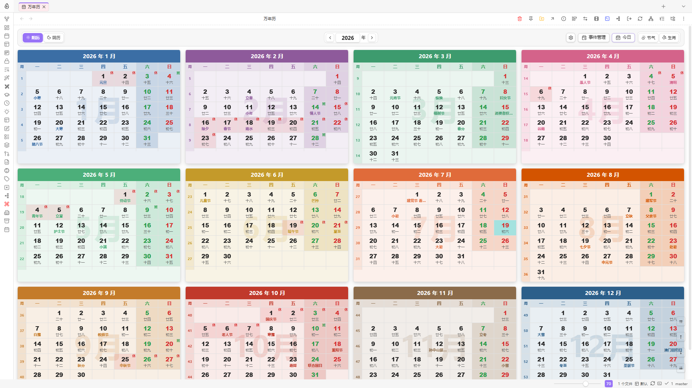
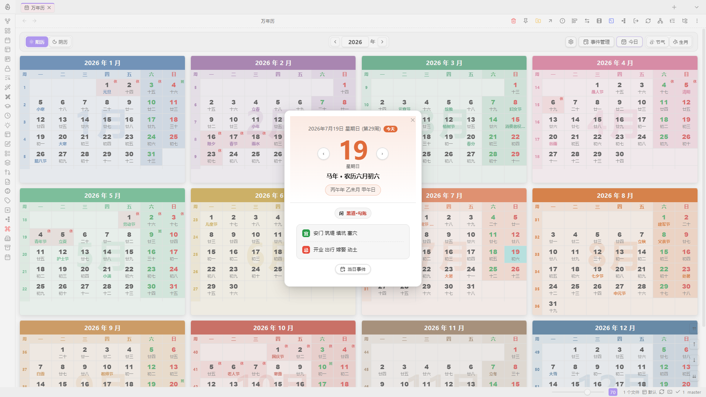
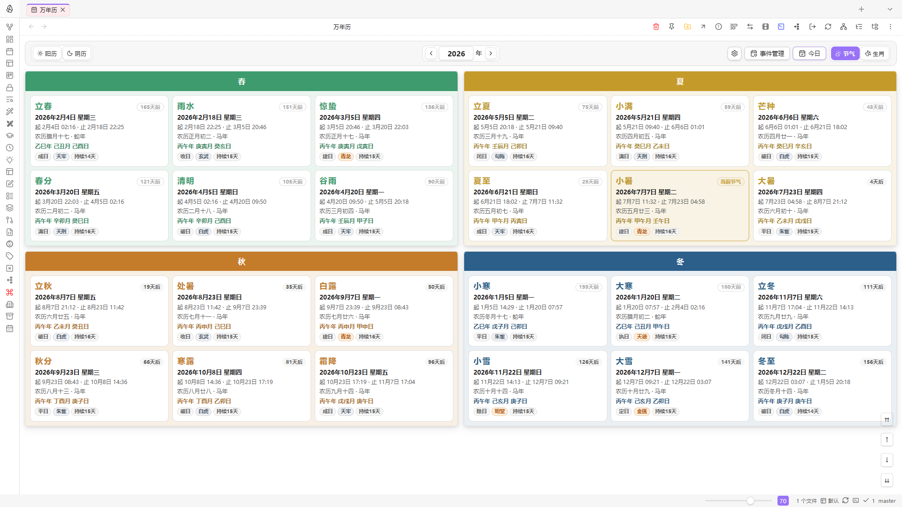
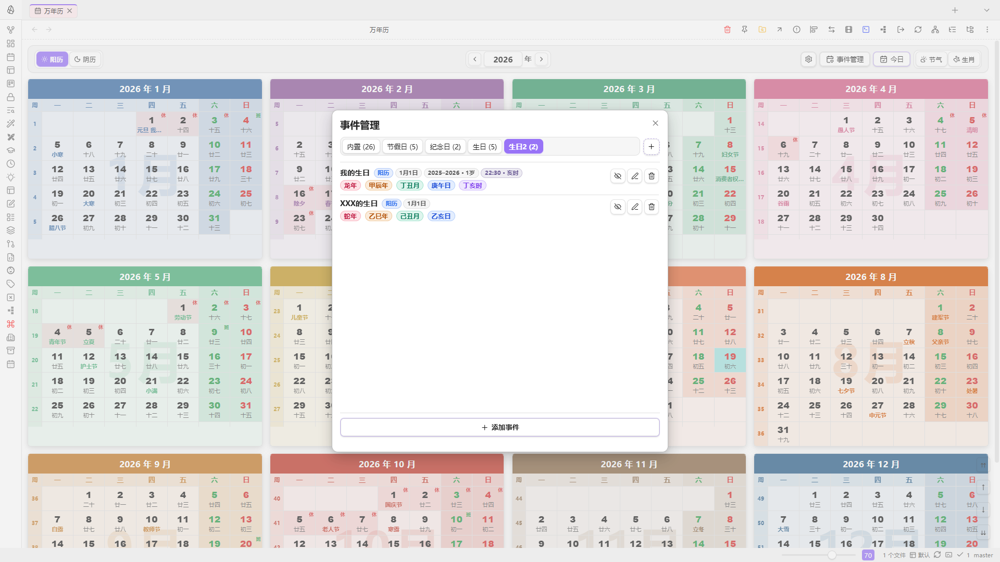

# Obsidian 万年历

在 Obsidian 新标签页中查看中国万年历：阳历 / 阴历年视图、二十四节气、十二生肖年表，以及黄道吉日与自定义事件。

**要求：** Obsidian ≥ 1.13.0

## 预览

**年视图（阳历 / 阴历）**



**黄道吉日（宜 / 忌）**



**二十四节气**



**事件管理**



## 功能

### 打开方式

- 左侧功能区日历图标
- 命令面板 →「打开」

### 视图模式

| 模式 | 说明 |
|------|------|
| 阳历 | 公历年视图，自适应网格展示 12 个月 |
| 阴历 | 农历月序年视图 |
| 节气 | 当年二十四节气，按春夏秋冬分组，高亮当前节气 |
| 生肖 | 1900–2099 干支年表；支持表格 / 卡片，按子鼠…亥猪筛选，卡片可按三元九运分段 |

工具栏支持年份切换与「今日」回到今年；节气、生肖入口在「今日」右侧。

### 日期与黄历

- 悬停日期：农历、干支、节日摘要
- 点击日期：弹出黄历详情（宜忌、节气节日、公历农历干支），左右箭头切换日期
- 国务院放假 / 调休：自动同步近年数据，日期格标注「休」「班」

### 自定义事件

- 按标签页分类（内置节假日、生日等，可自建）
- 支持阳历 / 阴历、起止年份、时刻、备注
- 可选在列表中显示生肖、八字

### 显示设置

工具栏齿轮可调整：此刻信息、周次、彩色主题、月份 / 生肖背景、阴影、月卡宽度与间距等。

## 开发

```bash
npm install
npm run dev      # 监听构建
npm run build    # 生产构建
npm run lint     # 代码检查
```

构建产物：`main.js`、`styles.css`、`manifest.json`。

## 信息

| 项目 | 内容 |
|------|------|
| 仓库 | [PandaNocturne/obsidian-wannianli](https://github.com/PandaNocturne/obsidian-wannianli) |
| 插件 ID | `wannianli` |
| 版本 | 1.0.0 |
| 作者 | [PandaNotes](https://github.com/PandaNocturne) |
| 最低 Obsidian | 1.13.0 |
| 许可证 | [0BSD](LICENSE)（BSD Zero Clause License） |

本仓库代码以 **0BSD** 发布：可自由使用、修改与分发，无需保留版权声明；软件按「原样」提供，作者不承担任何担保责任。详见 [LICENSE](LICENSE)。

农历推算与国务院放假数据分别来自历法算法与公开数据源，仅供参考，请以官方发布为准。
